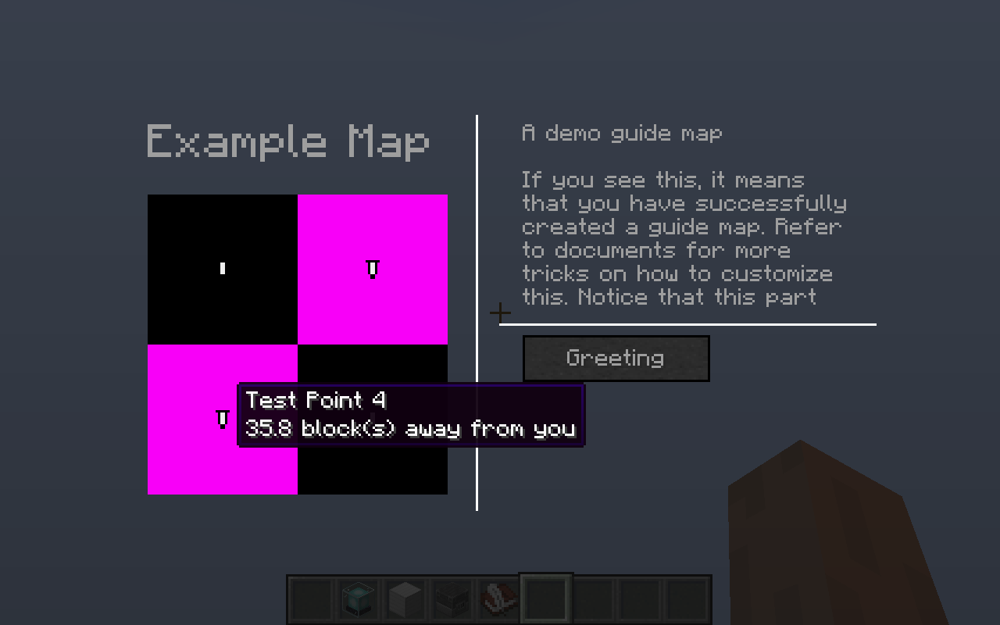

# SignMeUp 策划

SignMeUp 是一个允许玩家在游戏内查看地图并对地图上的点交互的 Mod。

SignMeUp 的相关定义位于 `data/<domain>/signup_guides/<path>.json` 里，分为三种。

数据包中 JSON 的读入可通过向 `AddReloadListenerEvent` 中添加 `JsonReloadListener` 实现。

## 导引图

第一种定义以 `"type": "map"` 开头，代表一张导引图（其中包含一张地图），以下是示例：

```javascript
{
  "type": "map",                        // 必需项

  "title": { "text": "Example Map" },   // 导引图的名字，显示在界面的左上角，使用 JSON 文本解析
                                        // 可选，如果不存在，则用语言文件中的一个默认值

  "subtitle": { "text": "Example" },    // 导引图的子名字，显示在界面右侧最上方，使用 JSON 文本解析
                                        // 可选，如果不存在，则与 `title` 相同

  "description": { "text": "Foo Bar" }, // 导引图的介绍，显示在子名字的下面，使用 JSON 文本解析
                                        // 可选，如果不存在，则游戏中不渲染
                                        // 渲染介绍时记得换行

  "range": 1024,                        // 地图一条边的长度，即中心点离边缘距离的两倍
                                        // 可选，默认值为 256，但需在后台弹出警告

  "center": [0, 0],                     // 地图中心点位置，如果是三个数则忽略中间那个
                                        // 可选，默认值为 [0, 0]，但需在后台弹出警告

  "world": "minecraft:overworld",       // 地图所处的世界，可由 `Registry.DIMENSION` 查找
                                        // 可选，如果不添加则代表适用于任何世界
                                        // 若为一个不存在的世界（如 `minecraft:impossible`）
                                        // 则代表该导引图被废弃

  "texture": "modid:textures/foo/bar",  // 由资源包的文件决定，是方形地图的材质
                                        // 可选，如果不存在则渲染一个 missing 上去

  "points": [                           // 导引图中的导引点列表
    "foo:points/bar",                   // 由 `data/foo/signup_guides/points/bar.json` 决定
    "foo:points/baz"                    // 由 `data/foo/signup_guides/points/baz.json` 决定
  ],                                    // 可选，默认值为空，不存在文件的报错并忽略

  "triggers": [                         // 导引图右下角全局按钮列表（见图）
    "foo:triggers/bar",                 // 由 `data/foo/signup_guides/triggers/bar.json` 决定
    "foo:triggers/baz"                  // 由 `data/foo/signup_guides/triggers/baz.json` 决定
  ]                                     // 可选，默认值为空，不存在文件的报错并忽略
}
```

## 导引点

导引点是导引图中的一个点，定义以 `"type": "point"` 开头，以下是示例：

```javascript
{
  "type": "point",                      // 必需项

  "title": { "text": "Example Point" }, // 导引点的名字，显示在界面右侧最上方，使用 JSON 文本解析
                                        // 可选，如果不存在，则用语言文件中的一个默认值

  "description": { "text": "Foo Bar" }, // 导引点的介绍，显示在名字的下面，使用 JSON 文本解析
                                        // 可选，如果不存在，则游戏中不渲染
                                        // 渲染介绍时记得换行

  "selector": "@e[gamemode=adventure]", // 筛选能够显示该导引点的玩家（目标选择器）
                                        // 如果玩家不满足该目标选择器则不显示
                                        // 目标选择器的执行目标为服务器，执行位置为导引点位置
                                        // 可选，默认值为字符串 `@e`（所有实体）

  "location": {                         // 导引点的位置，可以为一个 JSON 对象
    "actual": [42, 84, 0],              // `actual` 代表的是导引点的实际位置
    "render": [42, 84, 0]               // `render` 代表的是导引点在地图上的显示位置
  },                                    // `render` 是可选的，默认和 `actual` 相同
                                        // 如果是两个数则将 y 设置为当前世界海平面高度
                                        // 位置所处世界以为引用导引点的导引图为准
// or: "location": "dynamic",           // 此处也可以使用字符串 `dynamic` 替代 JSON Object
                                        // 从而使得玩家可以使用命令设置位置（见下）
                                        // `dynamic` 位置所处世界以命令设置的世界为准，因此
                                        // 如果命令设置的世界和导引图所处世界不重合，则不显示
                                        // 可选，默认值为字符串 `dynamic`

  "triggers": [                         // 导引图右侧导引点按钮列表（见图）
    "foo:triggers/bar",                 // 由 `data/foo/signup_guides/triggers/bar.json` 决定
    "foo:triggers/baz"                  // 由 `data/foo/signup_guides/triggers/baz.json` 决定
  ]                                     // 可选，默认值为空，不存在文件的报错并忽略
}
```

## 触发器

触发器是导引图中位于右侧的按钮，分为导引图定义的全局按钮（位于右下角）和导引点定义的导引点按钮（位于右侧）。

触发器的定义以 `"type": "trigger"` 开头，以下是示例：

```javascript
{
  "type": "trigger",                    // 必需项

  "title": { "text": "Test Trigger" },  // 触发器按钮上写的名字，使用 JSON 文本解析
                                        // 可选，如果不存在，则用语言文件中的一个默认值

  "description": { "text": "Foo Bar" }, // 触发器的介绍，使用 JSON 文本解析
                                        // 可选，如果不存在，则游戏中不渲染
                                        // 如果存在，玩家鼠标悬浮上去的时候渲染

  "disabled": false,                    // 该按钮是否被禁用
                                        // 可选，默认值为布尔值 `false`

  "selector": "@e[gamemode=adventure]", // 筛选能够显示该触发器的玩家（目标选择器）
                                        // 如果玩家不满足该目标选择器则不显示对应按钮
                                        // 目标选择器的执行目标为服务器
                                        // 如果在导引点中，则执行位置为导引点的位置
                                        // 如果是导引图的全局按钮，则执行为导引图的中心
                                        // 可选，默认值为字符串 `@e`（所有实体）

  "command": "/teleport ~ ~ ~"          // 玩家在游戏中按下按钮时触发的命令
                                        // 请将玩家的权限等级设置为 2
                                        // 如果在导引点中，则将位置设置为导引点的位置
                                        // 如果是导引图的全局按钮，则设置为导引图的中心
                                        // 最后将命令执行的 feedback 关掉
}
```

## 动态更新

上述所有目标选择器均在每 tick 发生时对所有打开导引图的玩家调用检测。

如果检测结果发生变化则将变化发送给客户端玩家，从而使导引图发生动态更新（例如右侧按钮的变化等等）。

`/reload` 命令执行后也应将变化发送给客户端玩家。

不必担心每 tick 调用目标选择器的性能问题：对于一张命令地图，每 tick 可能有上千次目标选择器的调用。

## 命令

以下所有命令执行等级为 2（或者你愿意，用权限也行吧）。

* `/signmeup map list`：查看所有导引图
* `/signmeup map open`：为玩家打开导引图，请使用 `CommandSource` 提供的位置确定打开哪一个
* `/signmeup map open <domain:path>`：为玩家打开特定的导引图

* `/signmeup point list`：查看所有导引点和它们的距离
* `/signmeup point get <domain:path> location`：查看导引点的实际位置和地图上渲染的位置
* `/signmeup point set <domain:path> location actual <x> <y> <z>`：设置导引点的实际位置
* `/signmeup point set <domain:path> location render <x> <y> <z>`：设置导引点地图上渲染的位置

## 游戏逻辑

注册一个按键，按键按下时，游戏按 `ResourceLocation` 的顺序选出：

* 位于所处的世界（`world` 决定）
* 没有离开地图的范围（`range` 和 `center` 决定）

均满足的第一个导引图（`ResourceLocation` 是有序的）。

导引图的左上角是标题，下方是 128x128 大小的地图（由资源包渲染），右上角是子标题，下面是介绍，右下角是所有触发器按钮的列表，竖直排列。

触发器按钮的列表应为可以上下滚动的列表，以便在按钮数量过多时隐藏溢出的部分。

导引图的地图中有若干导引点，只显示：

* 被导引图引用的
* 选择器满足目标的（`selector` 决定）
* 位置不为 `dynamic`，或已由命令设置并处于同一世界的
* 位置位于地图之内的

四者均满足的导引点。

玩家鼠标悬停在导引点上时显示其名称和距离，距离最近的导引点显示水波动画。导引图不显示玩家位置。

玩家点击任一导引点，该导引点变为选中标记，同时右侧显示导引点的信息。

导引点信息：右上角是标题，下面是介绍，右下角是导引图和导引点触发器按钮的叠加列表，导引点的位于更靠上的位置。

玩家点击地图上导引点以外的位置显示导引图的子标题和介绍。

玩家鼠标悬停在触发器按钮上时显示触发器的介绍，点击按钮执行命令，并关闭导引图。

动态更新时如果导引点存在，则继续显示该导引点，否则显示导引图的子标题和介绍。

## 示意图


